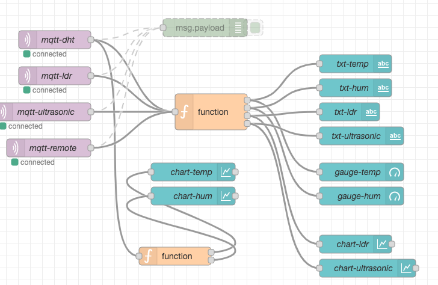
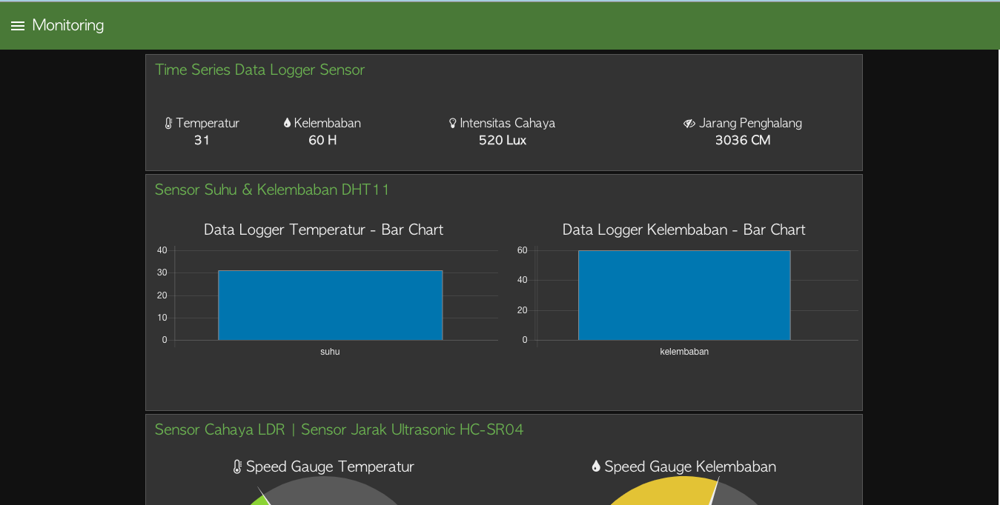

# Contoh kode program IoT Development Board

Digunakan untuk workshop di kampus tercinta Polinema pada 28 Juni 2021

## Flow

Silakan import flow berikut [ini](flows/flows.json) untuk menampilkan data dari code program

## Hasil Flow Node-RED

Rancangan dari flow yang dihasilkan dapat dilihat seperti pada gambar di bawah ini

## Dashboard

Hasil flow ketika dijalankan di browser adalah di bawah ini

